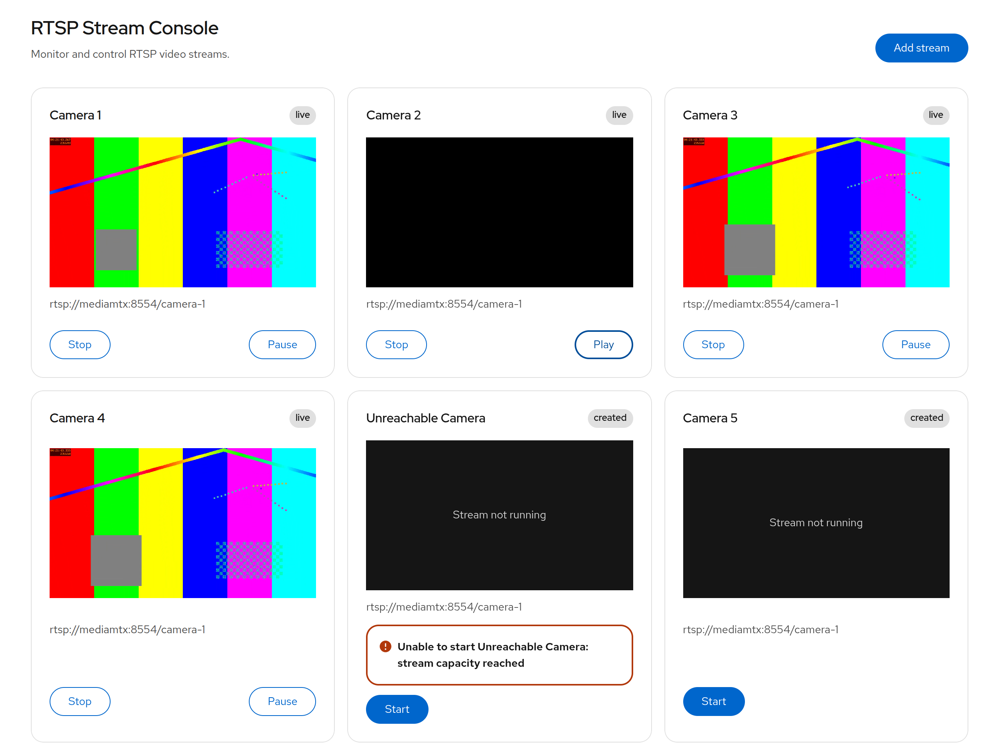

# RTSP Stream Console

[](https://github.com/dataolympus/rtsp-stream-console/actions/workflows/ci.yml)

A self-hostable web console for viewing and managing RTSP video streams in the browser.

RTSP Stream Console accepts RTSP sources, processes them with FFmpeg, and delivers browser-compatible H.264 MPEG-TS video over WebSockets. Multiple viewers can share one active stream runtime instead of starting a separate FFmpeg process for every browser.

Built with React, TypeScript, PatternFly, Go, FFmpeg, Docker Compose, Caddy, Terraform, and GitHub Container Registry.

## Preview



## Documentation

- [Architecture](docs/architecture.md) - runtime ownership, media flow, lifecycle, and deployment boundaries
- [Security](docs/security.md) - RTSP validation, authentication, resource controls, and known limitations
- [Deployment](docs/deployment.md) - local Compose, Azure, GHCR, DNS, TLS, updates, and rollback
- [Scaling](docs/scaling.md) - transcoding cost, viewer fan-out, worker evolution, WebRTC, and HLS
- [Contributing](CONTRIBUTING.md) - development setup and contribution workflow

## Features

- Register and manage multiple RTSP sources
- Start and stop stream processing from the browser
- View multiple streams in a responsive grid
- Play and pause individual browser viewers
- Share one stream runtime across multiple viewers
- Fan out MPEG-TS media over WebSockets
- Surface stream lifecycle and runtime errors
- Limit active FFmpeg runtimes
- Limit concurrent viewers per stream
- Rate-limit expensive API operations
- Restrict RTSP destinations for public deployments
- Run locally with Docker Compose
- Deploy to Azure with Terraform and deployment automation
- Pull prebuilt application images from GHCR

## Hosted demo

A hosted deployment is available at:

**https://streams.dataolympus.com**

Access may be restricted, and the hosted demo may be taken offline outside active review or demonstration periods.

The hosted environment includes a synthetic RTSP camera so the complete stream path can be tested without an external camera.

## Architecture

```text
                       RTSP source
                           |
                           v
                      +---------+
                      | FFmpeg  |
                      +---------+
                           |
                      MPEG-TS / H.264
                           |
                           v
                    +--------------+
                    |  Go backend  |
                    |  media Hub   |
                    +--------------+
                      |     |     |
                      |     |     |
                      v     v     v
                     WS    WS    WS
                      |     |     |
                      v     v     v
                 mpegts.js clients
                      |     |     |
                      v     v     v
                  <video> elements
```

The browser never connects directly to RTSP.

Each **started stream record** owns its own FFmpeg runtime. Multiple viewers of that record share the same backend media pipeline.

Creating multiple stream records with the same RTSP URL can therefore create multiple FFmpeg processes. The current implementation does not deduplicate runtimes by URL.

### Request path

```text
Browser
   |
   | HTTPS / WSS
   v
Caddy
   |
   +------ React frontend
   |
   +------ /api/* ----------+
   |                        |
   +------ WebSocket -----+ |
                         | |
                         v v
                    Go backend
                         |
                         | RTSP
                         v
                      FFmpeg
                         |
                         | MPEG-TS
                         v
                    fan-out Hub
                         |
                         v
                  browser viewers
```

## Stream lifecycle

```text
created
   |
   v
connecting
   |
   v
 live
   |
   v
stopping
   |
   v
stopped
```

Runtime or source failures move a stream into the `error` state.

Pausing playback in the browser disconnects only that viewer. It does not stop the shared backend stream runtime.

## Quick start

### Requirements

- Docker
- Docker Compose

Clone the repository:

```bash
git clone https://github.com/dataolympus/rtsp-stream-console.git
cd rtsp-stream-console
```

> **Verify the source checkout**
>
> If you are developing or reviewing the source, run the project checks before starting the application:
>
> ```bash
> ./scripts/check.sh
> ```
>
> This verifies:
>
> - Go tests
> - Go vet
> - frontend tests
> - frontend production build
> - local Docker Compose configuration
>
> A normal release deployment using published GHCR images does not require running the source test suite locally.

Start the local stack with the demo profile:

```bash
docker compose \
  --env-file deploy/compose/demo.env \
  -f deploy/compose/compose.yaml \
  -f deploy/compose/compose.local.yaml \
  --profile demo \
  up --build -d
```

Open:

```text
http://localhost:8082
```

Add the included synthetic RTSP stream:

```text
Name: Camera 1
URL:  rtsp://mediamtx:8554/camera-1
```

Then click **Start**.

The demo profile runs four containers:

```text
backend
frontend
mediamtx
test-camera
```

The local development flow does not enable Basic Auth.

Stop the stack with:

```bash
docker compose \
  --env-file deploy/compose/demo.env \
  -f deploy/compose/compose.yaml \
  -f deploy/compose/compose.local.yaml \
  --profile demo \
  down
```

## Production deployment

The deployment model separates infrastructure from application deployment.

```text
Terraform
   |
   v
VM + network + public IP + Docker
   |
   v
deploy-azure.sh
   |
   +---- checkout exact Git ref
   |
   +---- configure production environment
   |
   +---- pull published GHCR images
   |
   v
Docker Compose
```

### Azure infrastructure

Terraform configuration is available under:

```text
deploy/terraform/azure/
```

It provisions:

- Azure Resource Group
- VNet and subnet
- Network Security Group
- restricted SSH access
- public HTTP and HTTPS access
- static Standard public IPv4
- Linux VM
- Docker and Docker Compose through cloud-init

Example:

```bash
cd deploy/terraform/azure

terraform init
terraform plan
terraform apply
```

Terraform manages the host infrastructure. Application credentials are intentionally kept outside Terraform state.

### Application deployment

The Azure deployment wrapper discovers the VM through Terraform output and deploys an exact Git revision.

For a versioned release:

```bash
./scripts/deploy-azure.sh \
  --ref v0.1.0 \
  --release v0.1.0 \
  --site streams.example.com
```

Enable the synthetic camera for a demonstration deployment:

```bash
./scripts/deploy-azure.sh \
  --ref v0.1.0 \
  --release v0.1.0 \
  --site streams.example.com \
  --demo
```

For an existing deployment whose environment and credentials should be preserved:

```bash
./scripts/deploy-azure.sh \
  --ref v0.1.0 \
  --release v0.1.0 \
  --reuse-env \
  --demo
```

When a release is deployed, its backend and frontend image references are persisted in the production environment. A later `--reuse-env` deployment therefore continues using those exact images unless another `--release` version is supplied.

For development builds, a commit SHA and the `dev` image tag can be used instead.

## Container images

Application images are built by GitHub Actions and published to GitHub Container Registry:

```text
ghcr.io/dataolympus/rtsp-stream-console-backend
ghcr.io/dataolympus/rtsp-stream-console-frontend
```

Published images can be pulled anonymously.

Development deployments currently use:

```text
:dev
```

Versioned releases publish image tags such as:

```text
:v0.1.0
:0.1
:sha-<commit>
```

Production deployments should use the exact version tag such as `:v0.1.0`. The `dev` tag is intended for development and testing.

## Production credentials

Public deployments use Caddy Basic Auth at the edge.

There is deliberately **no default password**.

The deployment helper prompts for a password and stores only its bcrypt hash in:

```text
deploy/compose/prod.env
```

The file is excluded from Git.

The equivalent manual hash-generation flow is:

```bash
read -rsp "Reviewer password: " DEMO_PASSWORD
echo

DEMO_PASSWORD_HASH="$(
  printf '%s\n' "$DEMO_PASSWORD" |
    docker run --rm -i caddy:2-alpine \
      caddy hash-password
)"

unset DEMO_PASSWORD
```

A production environment contains values similar to:

```dotenv
SITE_ADDRESS=streams.example.com

DEMO_USERNAME=reviewer
DEMO_PASSWORD_HASH='$2a$...'
```

Never store the plaintext password in `prod.env`.

Basic Auth should only be used over HTTPS.

## Security model

The public deployment path includes several defensive controls.

### RTSP destination policy

By default, public deployments reject RTSP targets that resolve to:

- private networks
- loopback addresses
- link-local addresses
- multicast addresses
- unspecified addresses

RTSP URLs containing embedded credentials are also rejected.

Controlled internal hostnames can be explicitly allowlisted.

Self-hosted deployments that intentionally access private camera networks can opt into private-network RTSP sources.

The URL policy is a baseline SSRF mitigation. It should not be treated as a complete defense against every DNS-rebinding or network-level attack.

### Resource controls

Configurable protections include:

```text
MAX_ACTIVE_STREAMS
MAX_VIEWERS_PER_STREAM
EXPENSIVE_REQUESTS_PER_MINUTE
BACKEND_CPUS
BACKEND_MEMORY_LIMIT
BACKEND_PIDS_LIMIT
```

The hosted demo currently limits:

```text
active stream runtimes     2
viewers per stream         4
backend CPU                2
backend memory             1 GiB
backend PID count          128
```

Slow WebSocket subscribers use bounded buffers and can be disconnected rather than allowing one viewer to stall the shared media pipeline.

### Network exposure

A typical production deployment exposes only:

```text
22/tcp    restricted administrator SSH
80/tcp    HTTP redirect / certificate challenge
443/tcp   HTTPS application traffic
```

Backend port `8080` and RTSP port `8554` are not exposed publicly.

Basic Auth and application-level rate limits reduce casual abuse. Volumetric DDoS protection belongs at the cloud or edge layer.

## Configuration

Common production settings include:

```dotenv
RTSP_ALLOW_PRIVATE_NETWORKS=false
RTSP_ALLOWED_HOSTS=

MAX_ACTIVE_STREAMS=4
MAX_VIEWERS_PER_STREAM=8
EXPENSIVE_REQUESTS_PER_MINUTE=10

TRUST_PROXY_HEADERS=true

BACKEND_CPUS=2.0
BACKEND_MEMORY_LIMIT=1g
BACKEND_PIDS_LIMIT=128
```

`TRUST_PROXY_HEADERS=true` should only be enabled when the backend is behind a trusted reverse proxy.

## Scaling and trade-offs

The current architecture is intentionally optimized for a small self-hosted deployment.

Important scaling dimensions include:

- number of active RTSP sources
- number of concurrent viewers
- source bitrate and resolution
- software transcoding CPU cost
- geographic distance between cameras, compute, and viewers

The current implementation runs one FFmpeg process per started stream record and transcodes to H.264 for predictable browser compatibility.

For larger deployments, likely evolution paths include:

- H.264 stream-copy when compatible with the source
- hardware-accelerated transcoding
- distributed stream workers
- external runtime/state coordination
- WebRTC with an SFU for interactive fan-out
- HLS or LL-HLS with CDN distribution for large viewer counts

The current in-memory stream registry is appropriate for the demo and single-node deployment but is not intended as durable distributed state.

## Repository layout

```text
rtsp-stream-console/
├── backend/
│   └── Go API, stream runtime, FFmpeg integration and WebSocket fan-out
├── frontend/
│   └── React + TypeScript + PatternFly application
├── deploy/
│   ├── compose/
│   │   └── local and production Docker Compose configuration
│   └── terraform/
│       └── azure/
│           └── reproducible Azure infrastructure
├── docs/
│   └── deeper architecture and operational documentation
├── scripts/
│   ├── deploy.sh
│   ├── deploy-azure.sh
│   └── development helpers
└── .github/
    └── GitHub Actions workflows
```

## Technology

```text
Frontend          React + TypeScript + PatternFly
Browser media     mpegts.js
Backend           Go
Stream processing FFmpeg
Media transport   MPEG-TS over WebSockets
Demo RTSP server  MediaMTX
Edge              Caddy
Packaging         Docker + Docker Compose
Infrastructure    Terraform
Container registry GitHub Container Registry
Cloud example     Microsoft Azure
```

## Project status

RTSP Stream Console is under active development.

The current implementation has been exercised end to end with:

- HTTPS and automatic certificate management
- authenticated browser access
- RTSP playback over secure WebSockets
- multiple viewers sharing a stream runtime
- active-stream and viewer capacity enforcement
- slow-viewer eviction
- public RTSP destination filtering
- container resource limits
- Terraform-managed Azure infrastructure
- GitHub Actions-built GHCR images
- automated Azure application deployment

Versioned releases are verified by CI and published as Git tags and GHCR container images.

## License

Licensed under the [Apache License 2.0](LICENSE).
